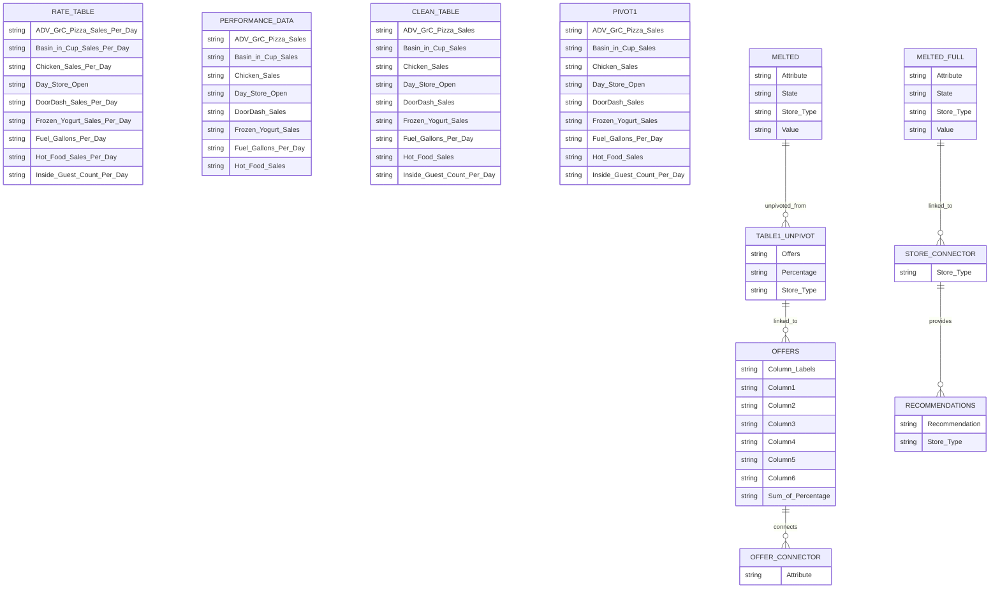

# FnB Store Product Mix Analysis

## 📊 Project Overview

This data analysis project provides **data-driven product mix recommendations** for new store openings in a Food & Beverage retail chain. By analyzing historical sales performance across different store formats, the project identifies optimal product assortments to maximize revenue potential.


## 🎯 Business Problem

**"What product mix should be recommended to new stores based on their format and location type?"**

Different store formats (5.5K urban stores, EDO hybrid stores, and Travel Centers) serve distinct customer demographics with varying needs and purchasing patterns.

## 📁 Project Structure

```
└── 📁fnb_store_analysis
    └── 📁dashboards
        ├── FnB_Product_Analysis_Dashboard.pbix
        ├── product_analysis_dashboard_preview.png
        ├── sales_by_store_type.png
    └── 📁data
        └── 📁processed
            ├── performance_data_cleaned.xlsx
        └── 📁raw
            ├── Case Study Performance Data.xlsx
    └── README.md
```

## 🛠️ Tools & Technologies

- **Power BI** - Data visualization & dashboard creation
- **Power Query** - Data transformation & cleaning
- **Excel** - Initial data exploration & analysis

## 🗃️ Data Model & Schema

### **Source Data Structure**

The analysis uses the following key tables and relationships:



## 📈 Key Insights & Recommendations

### Store-Type Specific Strategies


#### 🏙️ 5.5K Stores (Urban/Populated Areas)

- **Dominant Products:** ADV GnG (Pizza) 56.5%, Bean to Cup 28.1%
- **Recommendation:** Focus on grab-and-go convenience with pizza as anchor product and coffee as traffic driver

#### 🚛 EDO Stores (Mid-size Hybrid)

- **Balanced Mix:** ADV GnG (45.8%), with nearly equal split between Bean to Cup and Chicken (~22% each)
- **Recommendation:** Implement diverse menu catering to both local customers and travelers

#### 🛣️ Travel Centers (Highway/Truck Stops)

- **Varied Demand:** Strong performance across Pizza (40.9%), Coffee (24.2%), and Chicken (23.2%)
- **Recommendation:** Offer substantial meal options and consider delivery-to-vehicle services

## 📋 Data Preparation Process

The data was cleaned and transformed using Power Query:

1. **Handled Incorrect Values**
   - Standardized store type naming (`6 K` → `5.5 K`)
2. **Addressed Missing Data**
   - Replaced `null` values with `0` in numerical columns
3. **Feature Engineering**
   - Created standardized daily rates by dividing metrics by `Days Store Open`
   - Grouped and pivoted data for comparative analysis

## 📊 Dashboard Features

The interactive Power BI dashboard includes:

- Store-type performance comparisons
- Product contribution analysis
- Sales distribution visualizations
- Strategic recommendations by format

## 🚀 How to Use This Project

### For Recruiters & Hiring Managers

1. Review the **Key Insights & Recommendations** above
2. Check the `dashboard/` folder for the Power BI dashboard

### To Reproduce the Analysis

1. Download the `.pbix` file from `dashboard/`
2. Open with Power BI Desktop
3. Connect to the source data in `data/processed/` folder

## 💡 Business Impact

This analysis enables:

- **Informed inventory decisions** for new store openings
- **Optimized shelf space allocation** based on proven sales patterns
- **Targeted marketing strategies** for different customer segments
- **Reduced trial-and-error** in product assortment planning

## 📫 Contact

**Mohd Hammad Yousuf**

- GitHub: [@dexhamter](https://github.com/dexhamter)
- LinkedIn: [Hammad Yousuf](https://linkedin.com/in/hammad-yousuf)

---

_This project was completed as part of a data analytics portfolio. The data has been anonymized and modified for demonstration purposes._
